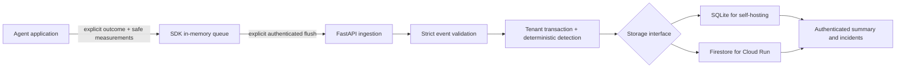

# Architecture

ReliaMesh 0.1.0 is one Python service, one deterministic analysis engine, and a
standard-library Python SDK. Prefiler Labs Private Limited owns the project;
the core is Apache-2.0.

The SDK does not inspect application inputs, outputs, span events, or exception
messages. Applications report semantic failure findings as classifications. The
server rejects unknown fields instead of retaining an arbitrary attribute bag.
The tenant comes from the authenticated credential; clients cannot select another
tenant through event data.

Ingestion validates the entire batch and updates bounded tenant state in one
transaction. Deduplication, quotas, window changes, and incident changes commit
together. Pure analysis code has no network dependency and can run in tests without
storage. Firestore retries its transaction callback on contention; the callback
does not send messages or perform other external actions.

## Analysis

Each stream groups deployment, agent, operation, and synthetic status. Version
labels remain observations within that stream so a version change does not erase
the comparison baseline. Events must arrive chronologically within their stream;
late events are rejected. Failure-rate comparisons use Wilson intervals and
minimum differences; median-based numerical signals use conservative sample and
threshold gates. Incidents remain open until recovery criteria are met. See
[the detection contract](detection.md) for exact behavior.

There is no claim that a version association proves causation. Small samples,
missing observations, workload mix changes, application classification mistakes,
and malicious submissions can all affect conclusions. No expensive inference
service participates in detection.

## Deliberate bounds

The initial engine retains at most 16 streams per tenant, 8 active version
combinations per stream, two 50-observation windows per stream, 2,048 deduplication
entries, and 32 incidents. State and request byte limits add a second bound.
When a limit cannot be safely satisfied, ingestion rejects the batch rather than
silently pretending to analyze it. Seven-day retention limits freshness; tenant
summary responses publish current analysis limits.

One Firestore document holds analysis state per tenant. This is a practical low
volume design, not a high-throughput event lake: tenant writes serialize and a hot
tenant can cause contention. The configured default daily quota is 10,000 accepted
events per tenant. Request throttles are per process; the daily ingestion quota
is persisted transactionally. Horizontal scaling multiplies the process-local
request allowance, so deployment instance bounds also matter.

SQLite supports a small deployment on persistent local disk. Use its backup API
or a consistent stopped-service snapshot; copying only the database file while
WAL writes are active is not a reliable backup. Ephemeral Cloud Run disk is not
used as a production database. Firestore is behind the storage interface so the
analysis and protocol remain independently useful with SQLite.

## Network and deployment boundary

No self-hosted component ships observations to a global network. `/v1/network`
reports disabled. A correlation primitive can be tested with explicit verified
cohort records, but an authenticated submission does not establish independent
organizational identity. Operational federation, independent cohort verification,
privacy budgets, and a publication review process are prerequisites to enabling
real network intelligence. Synthetic evidence cannot establish that network.

Managed deployment uses only Google Cloud project `reliamesh`. Cloud Run, Firestore,
and project-scoped service identities are deployment concerns, not SDK dependencies.
No blockchain, payment system, cross-project infrastructure, or external paid
service is part of this release.
