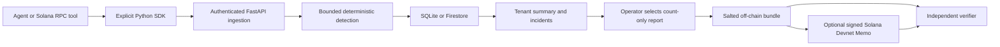

# ReliaMesh technical dossier

Owner: **Prefiler Labs Private Limited**. Public contact: **founder@prefiler.com**.
Evidence is dated; synthetic exercises are not customer adoption or an SLA.

**Readiness boundary:** the working core and optional Solana code have reproducible
technical evidence. Finalized Devnet ledger evidence remains pending free faucet
funding and its human verification. No on-chain ReliaMesh transaction, custom program
deployment or completed Solana grant readiness is claimed before that succeeds.

## Product and public entry points

ReliaMesh is open-source reliability infrastructure for AI agents. A standard-library
Python SDK emits classified execution outcomes and numerical measurements. The service
detects high failure rates and deterioration in failures, latency, token use and retries,
associates observations with versions, and tracks incident recovery. It does not infer
task success from HTTP status or inspect prompts, model outputs or tool content.

| Resource | Public URL |
|---|---|
| Website | https://reliamesh.com |
| Managed API | https://api.reliamesh.com |
| Health / HTTP contract | https://api.reliamesh.com/health · https://api.reliamesh.com/openapi.json |
| Company repository | https://github.com/PrefilerLabs/reliamesh |
| 0.2.0 release and final verification assets | https://github.com/PrefilerLabs/reliamesh/releases/tag/v0.2.0 |
| Released baseline | https://github.com/PrefilerLabs/reliamesh/releases/tag/v0.1.0 |
| SDK package | https://pypi.org/project/reliamesh-sdk/ |
| Server package | https://pypi.org/project/reliamesh-server/ |
| Solana agent example | [Runnable read-only integration](solana-agent-example.md) |
| Devnet specification and proof | [Commitment/verifier](solana-attestation.md) · [exact evidence](evidence/solana-devnet/README.md) |

Managed tenant access is operator-provisioned. Self-hosting requires no company
account, cloud service, wallet or telemetry export. The public repository and core
packages use **Apache-2.0**, with company copyright/NOTICE and a reviewed dependency
license inventory. The SDK has **zero runtime dependencies**. Security reporting:
[SECURITY.md](../SECURITY.md). No token or commercial billing product exists.

## Architecture and Solana's role



The Solana example evaluates RPC readiness for an agent before a potential downstream
action. It classifies RPC errors, malformed responses and stale/expired state without
storing account or transaction contents. It performs no trade, transfer or signing.
Labeled offline fixtures exercise regression and recovery without pretending that
Solana itself suffered an outage.

The optional adapter publishes a signed hash commitment to an explicitly selected
report. A developer can compare a disclosed report with a shared ledger reference
outside the publisher's server. Verification checks the expected signing key, exact
commitment transaction, and finalized Devnet inclusion through the official RPC.
An ordinary signed off-chain report remains sufficient when no ledger reference is
needed. Core detection and ingestion continue without Solana.

This uses the **existing Memo program**, not a custom deployed contract or program-owned
report account. It is an early public-good integration, not proof of a decentralized
reliability network. Exact account, program, transaction, fee, slot and Explorer links
belong in the linked Devnet evidence record, with a reproducible verification command.

## Privacy and security

Strict event validation rejects arbitrary attributes, prompts, responses, tool
arguments/results, exception messages and unknown fields. Allowed opaque labels are
still the integrator's responsibility: a secret hidden in an allowed label is not
automatically detected. Tenant operational aggregates are protected data.

API controls include high-entropy bearer keys stored as digests, scoped ingest/read/manage
permissions, revocation, tenant isolation, transactional quotas, duplicate/conflict checks,
bounded parsing and fixed error messages. Remote SDK connections require HTTPS and reject
redirects. There is no third-party analytics SDK or automatic network contribution.

The service suppresses observations older than seven days, bounds incident history and
uses asynchronous Firestore TTL for inactive state after seven days plus five minutes.
Tenant deletion removes active state and keys;
PITR, backups and platform logs have separate retention. Managed logs retain seven days
and can include IP/path/timing metadata. TLS minimum is 1.2. The runtime is non-root,
has no package installer, and uses project-scoped service accounts and secret references.

The on-chain memo reveals a commitment, payer and timing. Salt limits guessing before
disclosure; publishing the bundle reveals the selected counts. The ledger cannot erase
a published memo and does not attest telemetry truth, independent cohorts, completeness,
causality or real-world observation time. RPC-reported finality is trusted; the verifier
is not a consensus light client. Devnet may reset or prune history.

## Deployment, operating limits and costs

Only GCP project **`reliamesh`** is used. Cloud Run in **asia-south1** runs the API with
Firestore Standard Native storage, seven-day PITR and deletion protection. HTTPS serves
`reliamesh.com`, `www.reliamesh.com` and `api.reliamesh.com` through a global load balancer.
The certificate was ACTIVE for all three on 29 September 2026. Monitoring covers API
availability, server errors and unusual request volume, routed to founder@prefiler.com;
email delivery has not been validated through an induced outage.

| Technical limit | Current value |
|---|---:|
| Cloud Run resources / scaling | 1 vCPU, 512 MiB; 0–2 instances |
| Concurrency / request timeout | 16 / 30 seconds |
| Maximum batch / body | 100 events / 128 KiB |
| Per-tenant daily accepted-event quota | 10,000 |
| Per-process request throttle | 10 per second overall / 120 per minute per tenant |
| Retained baseline / current windows | 50 / 50 samples per stream |
| Streams / version sets per stream | 16 / 8 |
| Dedup entries / incident history | 2,048 / 32 |
| Detection state bound / retention | 650 KB / seven days |

The seven-day Monitoring query ending 29 September 2026 08:36:53 UTC returned **45,009
HTTP requests**, including 12,653 2xx, 32,356 4xx and **zero recorded 5xx**. The first
returned sample is seven hours after the query start; the gap is not verified zero
traffic. Most traffic was
404/429 rejection; probes, tests and possible bots are included. These are not users,
customers, accepted events or adoption. Mean platform latency of 3.018 ms mostly describes
probes/rejections and is **not an ingestion benchmark**. No uptime SLA is asserted.

Cost estimate, USD before credits/taxes: the existing forwarding-rule bundle is
**$0.025/hour, or $18.25 per 730-hour month**. Its attached static IPv4 has no separate
address charge. Observed compute/request use extrapolates to approximately $0.40/month
gross and sampled registry storage to $0.09/month: **about $18.74/month for those measured
components**, plus traffic/egress, Firestore/PITR/TTL, logging/monitoring, secrets,
domain and other unmeasured charges. Actual invoiced spend and remaining credits were
not available within project-only authorization. A two-instance cap is not a spending cap.
[Network pricing](https://cloud.google.com/vpc/network-pricing),
[Cloud Run pricing](https://cloud.google.com/run/pricing),
[registry pricing](https://cloud.google.com/artifact-registry/pricing),
[Firestore pricing](https://cloud.google.com/firestore/pricing).

## Verification and demonstrations

The 0.2.0 implementation passed **391 tests with one optional emulator test skipped**
on 2 October, followed by **17 passing CLI tests** after adding the read-only pending
status command. The release's attached verification record supplies the final exact
commit CI, deployment and package evidence. Offline interoperability against the
official Solana JavaScript SDK passed 13 checks, including independent construction
of byte-identical transaction messages and rejection of signature/memo mutations.
The actual deployed synthetic Solana-tool exercise accepted 200 observations,
opened and recovered the same incident, and dropped zero SDK events. See the
[dated execution record](evidence/solana-devnet/execution.json).

The 0.1.0 baseline passed **190 tests, with one optional emulator test skipped**;
separate deployed Firestore verification passed. Public CI tested Python 3.12/3.13,
lint, locked dependency vulnerabilities/licenses, secret history and the container.
[Baseline CI](https://github.com/PrefilerLabs/reliamesh/actions/runs/36330730983),
[deployment](https://github.com/PrefilerLabs/reliamesh/actions/runs/36330742249),
[Trusted Publishing](https://github.com/PrefilerLabs/reliamesh/actions/runs/36423989541).

The baseline release's four PyPI artifacts matched GitHub assets and all four PyPI
provenance attestations verified against this company repository. A fresh published
package install ingested 200 synthetic events, opened a regression, resolved that
same incident, and dropped zero SDK events. A consistent SQLite backup restored an
identical summary. Deployed checks ingested 201 synthetic events and verified replay
deduplication, privacy schema, tenant isolation, key scopes/revocation, readiness and
test-tenant deletion. Source-archive installation passed 102 targeted tests.

```sh
python -m pip install reliamesh-server==0.2.0 reliamesh-sdk==0.2.0
reliamesh tenant create grant-demo --output .local/grant-demo.json
reliamesh serve
# Second terminal, from the release source archive:
python examples/synthetic_regression.py --endpoint http://127.0.0.1:8080 --credentials .local/grant-demo.json
python examples/solana_rpc_agent.py --fixture
```

The linked Solana example and evidence provide live-read commands and the exact
pending ledger-proof boundary. Use the example output, repository architecture
diagram and website as application/demo evidence. Add a public Explorer transaction
only after a real finalized proof exists. Clearly label synthetic scenes
and disclose the released 0.1.0 baseline when describing later work.

## Honest limitations and reusable wording

No independent customer pilots, organic adoption, paid usage, calibrated detection
accuracy, verified cross-company cohorts, mainnet deployment or independent security
audit are established. The system has bounded single-region analysis, manual managed
onboarding, and no dashboard or billing product. Devnet anchoring alone is a modest
Solana-specific contribution; useful integrations and actual developer feedback are
needed to support a stronger ecosystem-benefit claim.

The hardened 0.2.0 candidate scan (5 October 2026) had zero critical, zero fixable
HIGH/CRITICAL and zero Python HIGH/CRITICAL findings. It fixes newly reported OpenSSL
and PCRE2 issues. **44 HIGH OS-package records across eight distinct CVEs with no
advertised fixes** remain. Reachability analysis and mitigations are documented
in [container security](container-security.md); this is not a clean-bill-of-health
claim. The exact deployed image requires its own verification, recorded with the
release. Managed-service customer legal notices,
founder/residency/prior-funding facts, budgets and application eligibility remain owner
business responsibilities, separate from technical execution.

**Reusable technical description:**

> ReliaMesh is Apache-2.0 reliability infrastructure for AI agents, developed by
> Prefiler Labs Private Limited. Its dependency-free Python SDK records classified
> execution outcomes and numerical measurements without collecting prompts, model
> responses or tool contents. A portable service detects tenant-local regressions
> and recovery using bounded statistical windows. The optional Solana Devnet
> integration lets developers publish and verify signed commitments to disclosed,
> privacy-minimized reliability reports; a read-only Solana RPC agent example
> demonstrates how to instrument tool readiness. Collection and detection work
> independently of the blockchain. Current evidence is reproducible synthetic
> testing and deployed technical verification, not a claim of independent adoption
> or independently audited telemetry.
